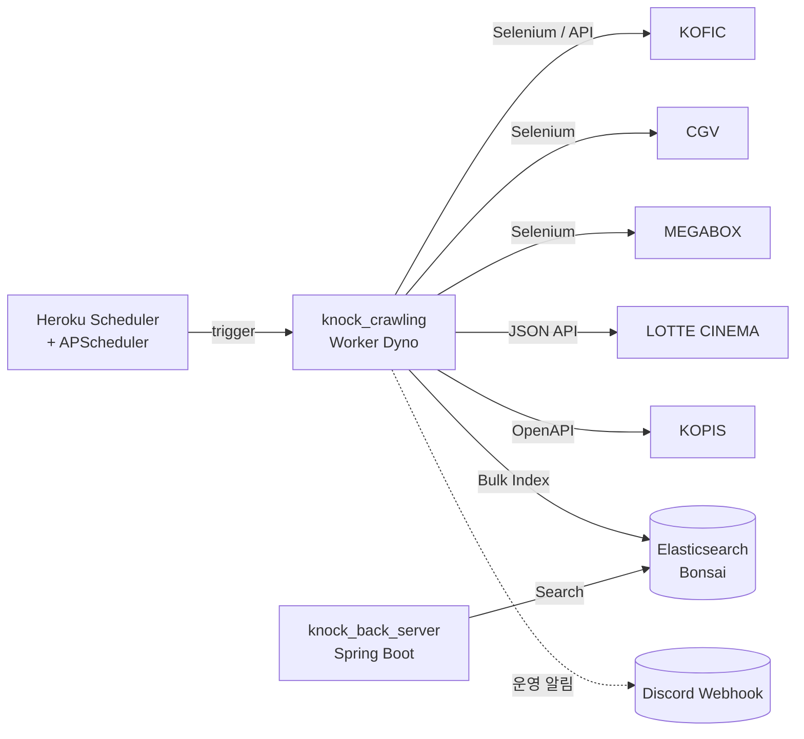

# 🎬 knock_crawling

> **KNOCK** — 영화·공연예술 개봉일 알림 서비스의 **데이터 수집 서버** · 백엔드 단독 설계·구현

[](https://heroku.com)
[](https://www.python.org/)
[](https://www.elastic.co/elasticsearch/)
[](https://www.selenium.dev/)

---

## 🔍 소개

`knock_crawling`은 [KNOCK](https://github.com/keaunsolNa/Knock) 서비스의 **데이터 수집을 담당하는 Python 기반 크롤러**입니다.
국내 주요 영화·공연 5개 플랫폼(KOFIC · CGV · MEGABOX · LOTTE CINEMA · KOPIS)을 주기적으로 크롤링해 Elasticsearch에 최신 개봉 정보를 업데이트합니다.

수집된 데이터는 [`knock_back_server`](https://github.com/keaunsolNa/knock-back-server)가 사용자에게 D-day 푸시 알림으로 전달하는 기반이 됩니다.

> 💡 본 서버는 KNOCK 사이드 프로젝트의 일부로 **백엔드 단독 설계·구현**한 것입니다. 5개 플랫폼의 서로 다른 응답 포맷·렌더링 방식을 어떻게 추상화했는지는 [아래 핵심 설계 결정](#-핵심-설계-결정)에 정리해 두었습니다.

---

## 🛠️ 기술 스택

| 영역 | 스택 / 라이브러리 |
|---|---|
| 언어 | Python 3.10+ |
| 크롤링 | `Selenium` (동적 렌더링 / 무한 스크롤) · `BeautifulSoup` · `requests` |
| 데이터 저장 | `Elasticsearch (Bonsai)` — `bulk` 인덱싱 |
| 스케줄러 | `APScheduler` (내부) + Heroku Scheduler (외부 트리거) |
| 알림 | Discord Webhook (운영 알림용) |
| 배포 | Heroku Worker Dyno · `Procfile` |

---

## 📦 크롤링 대상 — 5개 플랫폼

| # | 카테고리 | 플랫폼 | 수집 방식 |
|---|---|---|---|
| 1 | 🎬 영화 | **KOFIC** | 공식 OpenAPI |
| 2 | 🎬 영화 | **CGV** | 모바일 웹 + Selenium 동적 렌더링 |
| 3 | 🎬 영화 | **MEGABOX** | 웹 + 상세 페이지 진입 |
| 4 | 🎬 영화 | **LOTTE CINEMA** | 내부 JSON API |
| 5 | 🎭 공연 | **KOPIS** (공연예술통합전산망) | 공식 OpenAPI |

수집된 데이터는 Elasticsearch 인덱스로 저장되며, KNOCK 프론트엔드(Next.js)와 백엔드(Spring Boot)에서 검색·활용합니다.

---

## 🎯 핵심 설계 결정

### 1. **Template Method 패턴 — 5개 플랫폼 파서 추상화**
플랫폼마다 응답 포맷(JSON API · HTML · 동적 렌더링), 페이지네이션 방식, 상세 진입 URL 패턴이 모두 다릅니다. 공통 수집 흐름(`fetch → parse → normalize → upsert`)을 추상 클래스로 정의하고, 플랫폼별 차이는 메서드 오버라이드로만 처리하도록 설계했습니다.

```
BaseCrawler (template)
├── fetch_list()       # 목록 조회 — 플랫폼별 구현
├── parse_item()       # 단건 파싱 — 플랫폼별 구현
├── normalize()        # 공통 모델로 변환 — 공통 구현
└── upsert_to_es()     # ES 인덱싱 — 공통 구현
    │
    ├── KoficCrawler
    ├── CgvCrawler
    ├── MegaboxCrawler
    ├── LotteCinemaCrawler
    └── KopisCrawler
```

→ **신규 플랫폼 추가 시 기존 코드를 수정하지 않고 신규 클래스만 추가** (OCP 준수).

### 2. **유사도 기반 중복 병합 로직**
같은 작품이 플랫폼별로 제목·날짜·포스터가 제각각인 문제를 해결하기 위해, **다중 필드 매칭(제목 정규화 + 개봉일 근접 + 감독/배우)** 기반 유사도 알고리즘으로 동일 작품을 단일 레코드로 통합. KOFIC을 기준 레코드로 두고 다른 플랫폼 데이터를 보강하는 방식.

### 3. **bulk upsert 파이프라인**
ES `bulk` API를 사용해 수백~수천 건을 한 번에 인덱싱. 기존 데이터와 비교하여 `upsert` · `delete` · `merge`를 한 트랜잭션으로 처리.

---

## 🧭 시스템 아키텍처



---

## 🗂️ 디렉터리 구조

```
knock_crawling/
├── crawling/
│   ├── services/         # CGV · MEGABOX · LOTTE · KOFIC · KOPIS 각 크롤러
│   ├── base/             # BaseCrawler (Template Method) · WebDriver 설정
│   └── utils/            # 유사도 매칭 · 시간 변환 등 유틸
├── infra/
│   ├── elasticsearch_config.py
│   └── es_utils.py        # bulk upsert 헬퍼
├── scheduler/             # APScheduler 진입점
├── requirements.txt
└── Procfile               # Heroku worker용 프로세스 설정
```

---

## 🧪 실행 방법 (로컬)

### 1. 의존성 설치
```bash
pip install -r requirements.txt
```

### 2. `.env` 파일 생성
```dotenv
BONSAI_URL=

KOPIS_API_URL=http://kopis.or.kr/openApi/restful/pblprfr
KOPIS_API_URL_SUB=http://kopis.or.kr/openApi/restful/pblprfr
KOPIS_API_KEY=

KOFIC_API_URL=http://www.kobis.or.kr/kobisopenapi/webservice/rest/movie/searchMovieList.json
KOFIC_API_URL_SUB=https://www.kobis.or.kr/kobisopenapi/webservice/rest/movie/searchMovieInfo.json
KOFIC_API_KEY=

MEGABOX_API_URL=https://www.megabox.co.kr/movie/comingsoon
MEGABOX_API_URL_SUB=https://www.megabox.co.kr/movie-detail?rpstMovieNo=

CGV_API_URL=https://m.cgv.co.kr/WebAPP/MovieV4/movieList.aspx?mtype=now&iPage=1
CGV_API_URL_SUB=https://www.cgv.co.kr/movies/detail-view/?midx=

LOTTE_API_URL=https://www.lottecinema.co.kr/NLCHS/Movie/List?flag=5
LOTTE_API_URL_SUB=https://www.lottecinema.co.kr/NLCMW/Movie/MovieDetailView?movie=

DISCORD_WEBHOOK_URL=
CRON_MINUTE=
```

### 3. 실행
```bash
python scheduler/main.py
```

---

## ☁️ 배포 정보

- **플랫폼**: Heroku Python Worker Dyno
- **스토리지**: Elasticsearch (Bonsai Addon)
- **자동 실행**: APScheduler (내부) + Heroku Scheduler (외부 트리거)
- **운영 알림**: 크롤링 실패·이상 데이터 발견 시 Discord Webhook 발송

---

## 🔗 관련 서비스

- 🛎️ [KNOCK 메인 레포지토리](https://github.com/keaunsolNa/Knock)
- 🛠️ [KNOCK 백엔드 서버 레포지토리](https://github.com/keaunsolNa/knock-back-server)
- 📄 [KNOCK 소개 페이지 (Notion)](https://www.notion.so/1d0eb6c84ddd80da9dece7e09ec68c77)

---

## 🧑‍💻 개발자

| 이름 | 역할 | GitHub |
|---|---|---|
| 나큰솔 | 백엔드 단독 설계·구현 (크롤러·인덱싱 파이프라인) | [@keaunsolNa](https://github.com/keaunsolNa) |

---

## 📄 라이선스

MIT License © 2025 keaunsolNa — 전문은 [`LICENSE`](./LICENSE) 참조.
